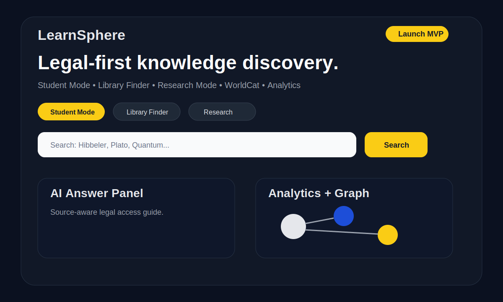

# LearnSphere

**One Search for All Knowledge.**

LearnSphere is a legal-first knowledge discovery platform that helps users find books, libraries, research topics, public-domain texts, courses, and trusted learning resources from one searchable interface.



## Why LearnSphere?

The web has many useful learning sources, but they are scattered across platforms such as Open Library, Google Books, WorldCat, Wikipedia, Project Gutenberg, and university course websites.

LearnSphere brings those sources together with a clean search experience, an AI-style answer panel, knowledge graph exploration, and student-focused learning modes.

> LearnSphere does **not** host pirated PDFs. It guides users toward legal previews, public-domain texts, libraries, official pages, and buy/borrow options.

---

## Features

- Legal-first knowledge search
- Student Mode, Library Finder, and Research Mode
- Open Library, Google Books, Wikipedia, Gutendex/Project Gutenberg, and WorldCat support
- AI-style answer panel
- Autocomplete search
- Dark mode
- Knowledge graph UI
- Missing-resource request system
- Basic analytics
- Account placeholder
- Admin placeholder
- Deployment configs for Render, Railway, Vercel, and Docker

---

## Local Setup Guide

```bash
npm install
cp .env.example .env
npm run dev
```

Then open:

```text
http://localhost:3000
```

---

## Project Structure

```text
learnsphere/
├── public/
├── server/
│   ├── data/
│   ├── routes/
│   └── services/
├── docs/
├── screenshots/
├── package.json
├── README.md
├── LICENSE
├── .env.example
├── Dockerfile
├── render.yaml
├── railway.json
└── vercel.json
```

---

## API Routes

```text
GET  /api/health
GET  /api/catalog
GET  /api/suggest?q=physics
GET  /api/search?q=calculus&mode=student
GET  /api/recommendations
GET  /api/requests
POST /api/requests
POST /api/analytics
GET  /api/analytics/summary
GET  /api/account/demo
GET  /api/admin/demo
```

---

## Environment Variables

Copy `.env.example` to `.env`.

```env
PORT=3000
NODE_ENV=development
GOOGLE_BOOKS_API_KEY=
OPENAI_API_KEY=
DATABASE_URL=
SESSION_SECRET=change-this-in-production
```

No real API keys, passwords, or private database credentials should be committed.

---

## Deployment

Recommended beginner-friendly deployment:

- Render
- Railway
- Docker

See:

```text
docs/DEPLOYMENT.md
```

---

## Validation Plan

Before adding more features, test LearnSphere with real users.

See:

```text
docs/VALIDATION.md
```

---

## Roadmap

- PostgreSQL database
- Real authentication
- Bookmarks and reading lists
- Real AI answer generation
- Meilisearch fuzzy search
- Admin dashboard
- Verified source moderation
- Public catalog data dumps
- University/library partnerships

---

## License

This project is licensed under the MIT License.

---

## Mission

To make knowledge easier to discover by connecting books, libraries, research, public-domain resources, and AI-assisted learning in one platform.

**LearnSphere — Search. Learn. Discover.**
